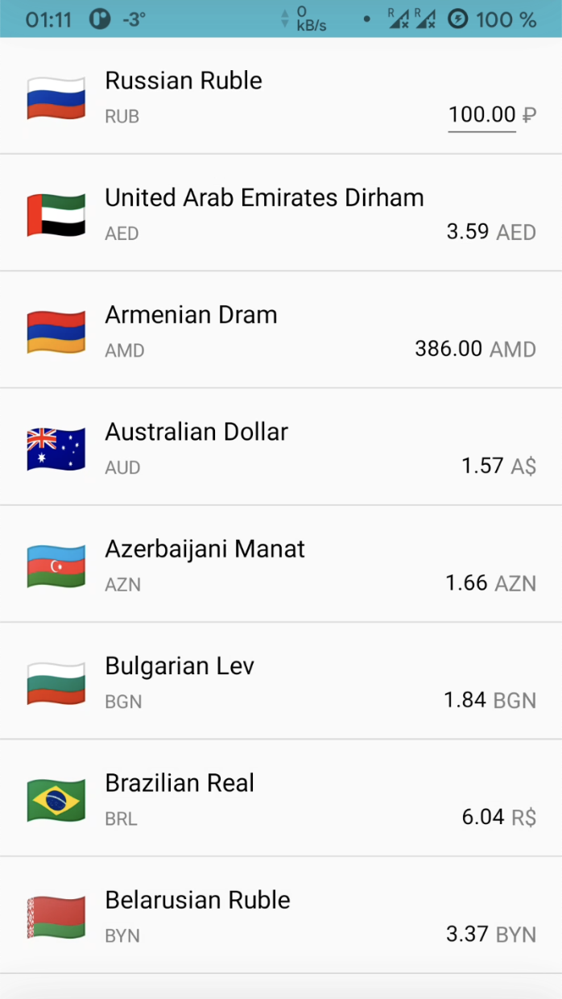

# Reactive Currencies

An Android application that leverages the Central Bank of Russia [API](https://cbr.ru/eng/currency_base/daily/) to fetch exchange rates for 44 currencies. Built with a focus on best practices, the app employs an MVVM architecture, Repository pattern, Room database, and utilizes key Android Architecture Components such as ViewModel and ViewBinding. It allows users to select a base currency and dynamically calculate exchange rates for other currencies based on the chosen value.

## Dependencies

* [Kotlin](https://github.com/JetBrains/kotlin) 2.1.0
* [RxJava](https://github.com/ReactiveX/RxJava) 3.1.10
* [Retrofit](https://github.com/square/retrofit) 2.11.0
* [Room](https://developer.android.com/training/data-storage/room) 2.6.1

## License

[MIT](LICENSE) © [alxiw](https://github.com/alxiw)
