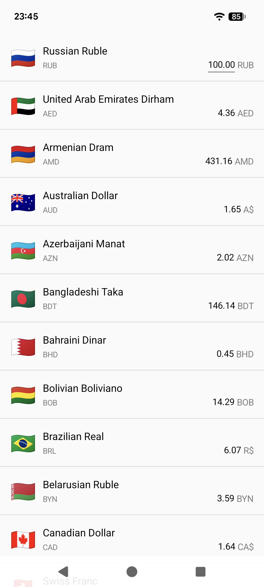

# Reactive Currencies

Android application for converting currencies using official exchange rates from the [Central Bank of Russia](https://cbr.ru/eng/currency_base/daily/), fetching data via [CBR Wrapper API](https://www.cbr-xml-daily.com/), covering more than 50 currencies.

The app follows the recommended [architecture guidelines](https://developer.android.com/topic/architecture) with a clean separation into data, domain, and presentation layers. The data layer is built around the Repository pattern, with a Room database used for local storage to keep the app fully functional offline once rates have been fetched. The presentation layer follows MVI pattern with Jetpack Compose as the UI framework. 

Users can select any currency as the base and instantly see recalculated exchange values for all other currencies based on the entered amount.

## Dependencies

* [Kotlin](https://github.com/JetBrains/kotlin) 2.4.20
* [Jetpack Compose](https://developer.android.com/compose) 1.12
* [RxJava](https://github.com/ReactiveX/RxJava) 3.1.12
* [Retrofit](https://github.com/square/retrofit) 3.0.0
* [Room](https://developer.android.com/training/data-storage/room) 2.8.5
* [DataStore Preferences](https://developer.android.com/topic/libraries/architecture/datastore) 1.2.1

## License

[MIT](LICENSE) © [alxiw](https://github.com/alxiw)
