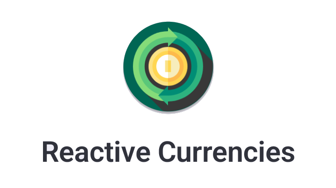
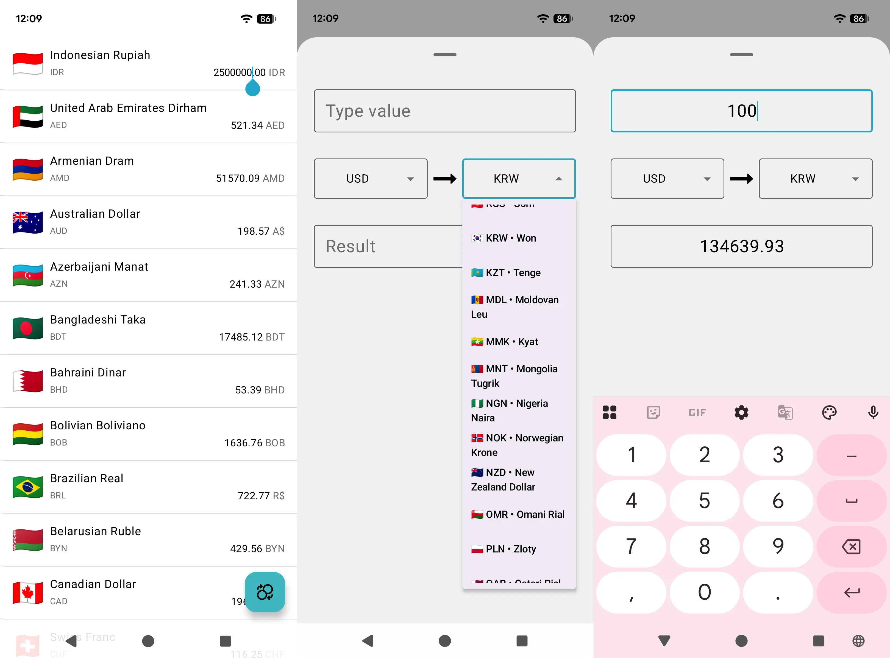

# Reactive Currencies

Android application for converting currencies using official exchange rates from the [Central Bank of Russia](https://cbr.ru/eng/currency_base/daily/), fetching data via the [CBR Wrapper API](https://www.cbr-xml-daily.com/) and covering more than 50 currencies. Built mainly as a showcase of modern Android development practices, though fully usable for real conversion too.

## Features

- **Live rate list** — select any currency as the base and instantly see recalculated values for all other currencies as you type an amount.
- **Quick converter** — tap the floating action button to open a separate, focused screen for converting one specific currency directly into another.
- **Offline support** — exchange rates are cached locally, so the app remains fully usable without a network connection once rates have been fetched. Pull-to-refresh lets you fetch the latest rates on demand.

## Architecture

The app follows Clean Architecture, with a clear separation into data, domain, and presentation layers.

- **Data layer** — built around the Repository pattern, backed by a Room database for local storage.
- **Presentation layer** — follows the MVI pattern, built with Jetpack Compose as the UI framework.
- **Reactivity** — implemented with RxJava rather than Kotlin coroutines/Flow. Coroutines would be the more conventional choice today and the codebase could be migrated to them fairly easily, but RxJava was deliberately kept here as an experiment in combining it with Jetpack Compose.
- **DI & navigation** — both are hand-written, simple custom solutions rather than third-party libraries, again as a deliberate exercise rather than a production requirement.

## Screenshots

## Dependencies

* [Kotlin](https://github.com/JetBrains/kotlin) 2.4.20
* [Jetpack Compose](https://developer.android.com/compose) 1.12
* [RxJava](https://github.com/ReactiveX/RxJava) 3.1.12
* [Retrofit](https://github.com/square/retrofit) 3.0.0
* [Room](https://developer.android.com/training/data-storage/room) 2.8.5
* [DataStore Preferences](https://developer.android.com/topic/libraries/architecture/datastore) 1.2.1

## License

[MIT](LICENSE) © [alxiw](https://github.com/alxiw)
